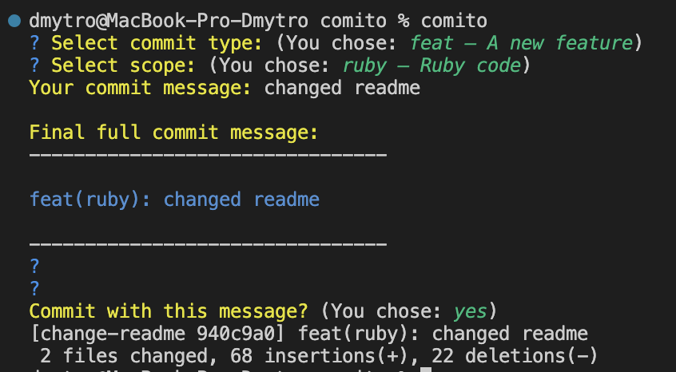

# Comito

Comito is a lightweight and intuitive Ruby CLI tool that provides an interactive interface for crafting commit messages following the **Conventional Commits** standard in Rails projects (and any Ruby-based project).

## Installation

```bash
gem install comito
```

Or add it to your project’s Gemfile:

```bash
gem "comito"
```

## Usage

```bash
comito
```

You’ll be guided through a series of prompts to build your commit message, with the option to confirm and commit directly.

## Features 

- 🚀 Interactive step-by-step interface to choose commit type (`feat`, `fix`, `chore`, `docs`, `style`, `refactor`, `test`, etc.).
- 🏷️ Optional **scope** support for more precise commit descriptions.
- 📝 Automatic commit message formatting according to the Conventional Commits standard.
- 🔧 Option to directly commit via Git after generating the message.
- 📦 Minimal dependencies — fully written in Ruby.
- 🎯 Perfect for Rails developers who want to standardize commit history.
- ⚙️ Easy integration with CI/CD pipelines and Git hooks.

## Why Comito?

- ❌ No need for Node.js, Rust, or other external tools — 100% Ruby.
- 🖥️ Simple to use — run `comito` and follow the interactive generator.
- 🔄 Flexible and extensible — easily adapted to your team’s workflow.
- 📚 Keeps your commit history clean and consistent for better collaboration and release management.

## Configuration File `comito_config.yml`

Comito allows you to create a custom configuration file `comito_config.yml` in the root directory of your project.

This file lets you override the default gem settings, such as commit types, scopes, and whether to confirm commit messages before committing.

Example config `comito_config.yml`:
```yaml
types:
  feat: "A new feature"

scopes:
  ruby: "Ruby code"

confirm_commit_message: false
```

### How `comito_config` works:

- Comito looks for the file `comito_config.yml` in the current directory (`Dir.pwd`)
- If the file exists, the settings are loaded from it.
- If the file does not exist, default values are used.

## Example



## License

Apache-2.0
